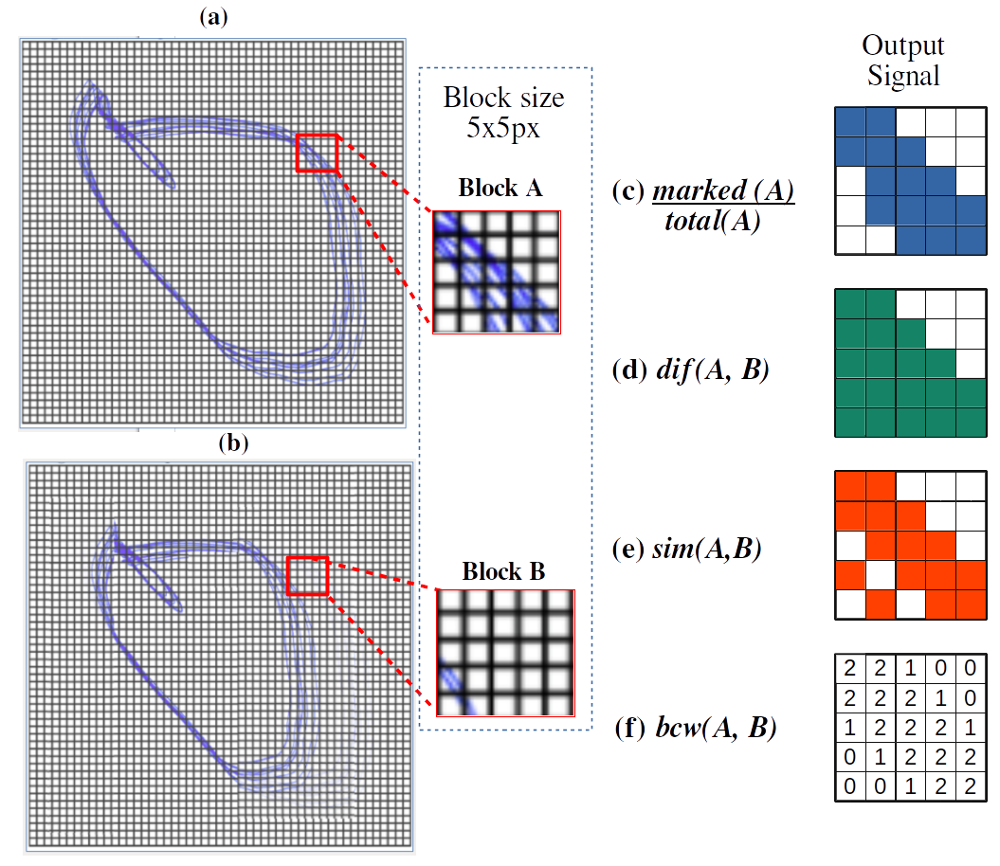

### Description

This repository contains the parameters were extracted from the Phase Space images, accomplished by the methods: box counting method, the difference method, the similarity method and the weighted box counting method ([Roopaei. *et al* (2010)](https://doi.org/10.1016/j.bspc.2010.05.003)). Each one generated a numeric value corresponding to the chaotic dimension of the Phase Space for each orthogonal Frank-lead, resulting in twelve parameters per VCG signal. These methods are illustrated below.

#### Metadata description

| Features | Description |
|--|--|
| x1 | Box counting method for derivation Vx |
| y1 | Box counting method for derivation Vy |
| z1 | Box counting method for derivation Vz  |
| x2 | Difference method for derivation  Vx |
| y2 | Difference method for derivation Vy |
| z2 | Difference method for derivation Vz |
| x3 | Similarity method for derivation Vx |
| y3 | Similarity method for derivation Vy |
| z3 | Similarity method for derivation Vz |
| x4 | Method of counting weighted boxes for derivation Vx |
| y4 | Method of counting weighted boxes for derivation Vy |
| z4 | Method of counting weighted boxes for derivation Vz  |

### Usage

    ## Import libs
    import pandas as pd
    from sklearn.model_selection import train_test_split
    
    ## Import data file
    df = pd.read_csv('data/block_size_XX.csv')

	## Split the data into train, test and validation
	train, test = train_test_split(df, test_size=0.25, random_state=5)
	train, val = train_test_split(df, test_size=0.1, random_state=5)

	## Apply any standardization technique

We encourage you to use the [StandardScaler](https://scikit-learn.org/stable/modules/generated/sklearn.preprocessing.StandardScaler.html?highlight=standardscaler#sklearn.preprocessing.StandardScaler) function from the scikit-learn library.

### References 

	@ARTICLE {barbosa2020machine,
	    author = "José Raimundo Barbosa and Renato Hortegal and Paulo Szewierenko and Rafael Duarte de Souza and Carlos Danilo Miranda Regis",
	    title  = "Machine Learning and Deep Learning for Myocardial Infarction Detection using Vectorcardiographic Data Mining",
	    year   = "2020"
	}
